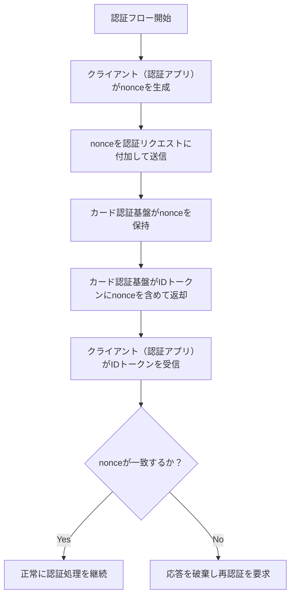
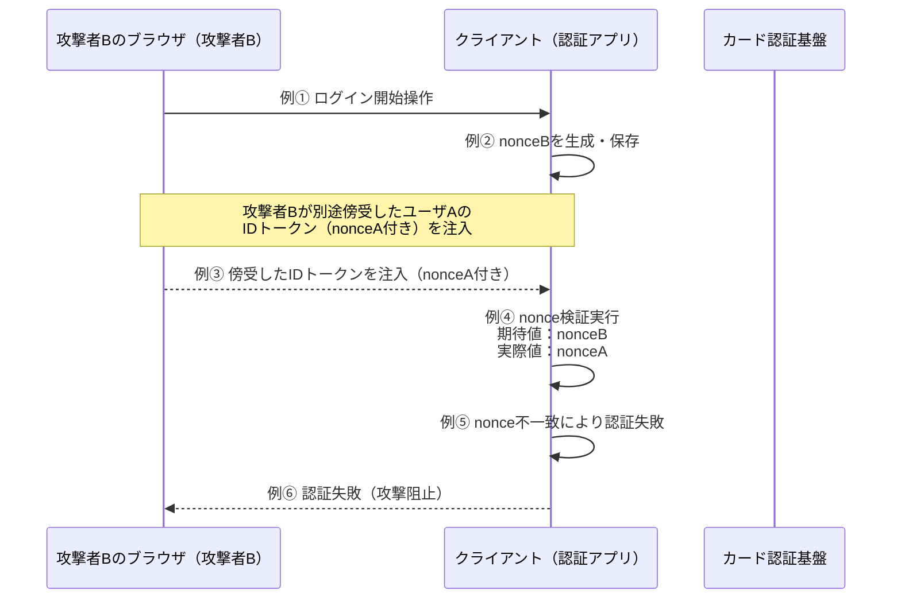
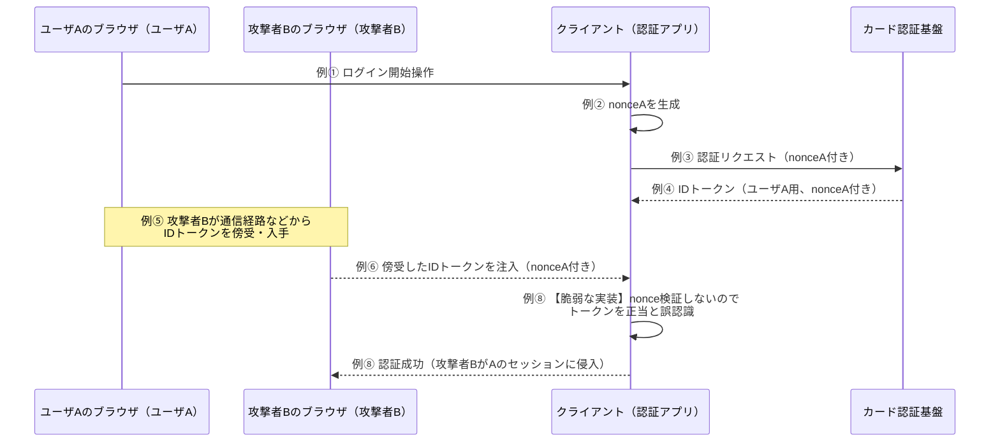

## `nonce` パラメータ利用目的（概要設計補足）

### 1. `nonce` の概要・役割  
`nonce` は「number used once」の略で、一意なランダム値を意味する。  
IDトークンの再利用・改ざん・リプレイ攻撃を防止するために使用する。

---

### 2. なぜ `nonce` が必要か

| 観点 | 説明 |
|------|------|
| 正当なログイン応答の確認の為 | クライアント（認証アプリ）は `nonce` をリクエスト時に送信し、応答のIDトークンに同じ値が含まれていることを検証することで、その応答が「自分が要求した正当な認証フローの結果」であることを確認できる。 |
| 不正ログイン防止の為 | `nonce` を用いることで、悪意のある第三者が過去のIDトークンを使って再ログインする「リプレイ攻撃」を防止可能。 **※リプレイ攻撃とは、事前に正しく発行されたIDトークンを盗み取って再利用し、不正にログインを試みる攻撃手法。正規ユーザーのセッションを装ってアクセスが成立する恐れがある。** |
| なりすまし防止の為 | 攻撃者が他ユーザの認証フローを横取りし、不正にログイン状態を得ることを防ぐ為に、`nonce` による照合を導入する。 **※ `nonce` が一致しなければ、認証応答は正規ユーザ向けのものではないと判断できるため、攻撃者が他人になりすますことができなくなる。** |

**※ トークン流用の防止の為  他のセッションやアプリで発行されたIDトークンを悪用してログイン処理を完了させることを防ぐ為に、毎回異なる `nonce` を発行し、照合することが重要。** 

---

### 3. `nonce` の仕様・運用方法

- クライアント（認証アプリ）が認証リクエストにてランダムな `nonce` 値を生成し、パラメータとして送信する。  
- カードカード認証基盤はIDトークンに同じ `nonce` を含めて返却する。  
- クライアント（認証アプリ）は受信したIDトークン内の `nonce` 値と、送信時の `nonce` 値が一致しているかを検証する。  
- 一致しない場合は、認証応答を破棄し、再認証を要求する等の対処が必要。

#### `nonce` 処理フロー

---

### 4. 参考：`nonce` の検証を省略した場合に生じるリスク

| リスク内容 | 説明 |
|------------|------|
| リプレイ攻撃 | 攻撃者が取得済みのIDトークンを別の端末・時間帯で利用して不正ログインを試みることが可能になる。 |
| セッション乗っ取り | 攻撃者が `nonce` の検証を行わない脆弱なクライアント（認証アプリ）に対して、認証フロー中に他人のIDトークンを差し込むことで、セッションを乗っ取る攻撃が成立する。 |

**※ 適切なnonce検証を実装していれば、これらの攻撃は防御可能です。**

#### セッション乗っ取り攻撃とnonceによる防御

##### 【適切なnonce検証がある場合】攻撃が防御される例

| ステップ | 内容 |
|---------|------|
| 例① | 攻撃者Bが自分のセッションで認証フローを開始 |
| 例② | 攻撃者Bのクライアント（認証アプリ）がランダムな `nonceB` を生成・保存 |
| 例③ | 攻撃者Bが別途傍受したユーザAのIDトークン（`nonceA`含む）を注入 |
| 例④ | クライアント（認証アプリ）が `nonce` の検証を実行 |
| 例⑤ | 期待値：`nonceB`、実際値：`nonceA` → **不一致により認証失敗** |
| 例⑥ | **攻撃者Bのセッション乗っ取り試行が阻止される** |

##### 【脆弱な実装】nonce検証を省略した場合の攻撃成功例

以下は `nonce` の検証を行っていないクライアント（認証アプリ）に対して、攻撃者が他人のセッションに侵入する例：

| ステップ | 内容 |
|---------|------|
| 例① | ユーザAが通常どおり認証フローを開始する（nonce付き） |
| 例② | クライアント（認証アプリ）がランダムな `nonceA` を生成 |
| 例③ | クライアント（認証アプリ）が `nonceA` を含む認証リクエストをカード認証基盤に送信 |
| 例④ | カード認証基盤が `nonceA` を含むIDトークンを返却 |
| 例⑤ | 攻撃者BがIDトークンをネットワーク経由などで傍受（中間者攻撃等） **※ 中間者攻撃とは、通信の途中に割り込んで内容を盗み見たり改ざんする攻撃。通信が暗号化されていない場合や、脆弱なネットワーク環境下で発生しやすい。** |
| 例⑥ | 攻撃者Bが脆弱なクライアント（認証アプリ）に、傍受したIDトークンを注入 |
| 例⑦ | **【脆弱な実装】**クライアント（認証アプリ）が `nonce` の検証を行わず、トークンを正当と誤認識 |
| 例⑧ | 攻撃者BがユーザAとして認証され、セッションに侵入 |

##### 適切なnonce検証による防御のシーケンス図

##### 脆弱な実装（nonce検証なし）のシーケンス図

### 5. 利用者に求められる対応

- クライアント（認証アプリ）実装側は、認証フロー開始時に毎回新たな `nonce` を生成し、レスポンス時に検証を行う必要がある。  
- `nonce` の生成・保存・照合処理は、セキュリティ確保の観点から省略不可。
- **適切なnonce検証により、セッション乗っ取りやリプレイ攻撃が防止される。**
- **nonce検証を省略した実装は、重大なセキュリティ脆弱性となる。**

#### nonce検証の必須処理

| 処理 | 内容 | 重要度 |
|-----|------|--------|
| nonce生成 | 認証フロー開始時に暗号学的に安全なランダム値を生成 | 必須 |
| nonce保存 | 生成したnonceをセッションに紐づけて保存 | 必須 |
| nonce照合 | IDトークン内のnonceと保存したnonceの一致を検証 | 必須 |
| 不一致時の対応 | nonce不一致時は認証を拒否し、エラーハンドリングを実行 | 必須 |
