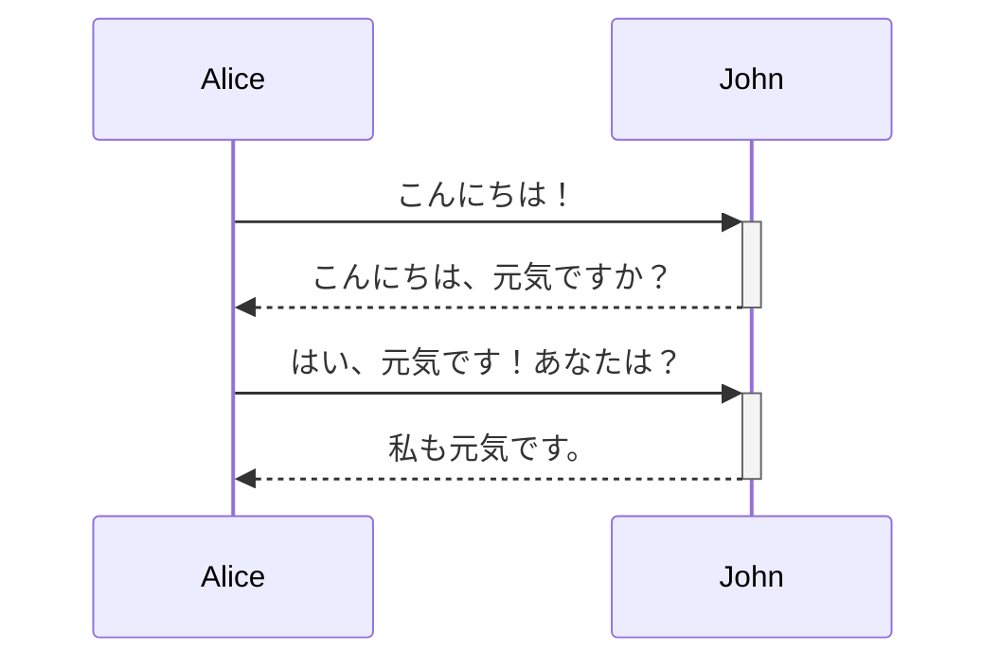
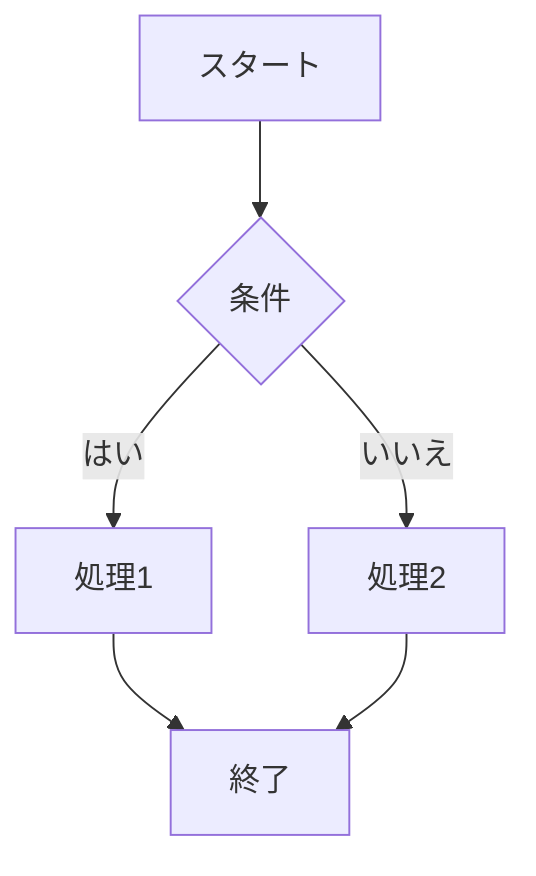

# シーケンス図のサンプル

```mermaid
sequenceDiagram
    Alice->>+John: こんにちは！
    John-->>-Alice: こんにちは、元気ですか？
    Alice->>+John: はい、元気です！あなたは？
    John-->>-Alice: 私も元気です。
```

# フロー図のサンプル

```mermaid
graph TD;
    A[スタート] --> B{条件};
    B -- はい --> C[処理1];
    B -- いいえ --> D[処理2];
    C --> E[終了];
    D --> E;
```

